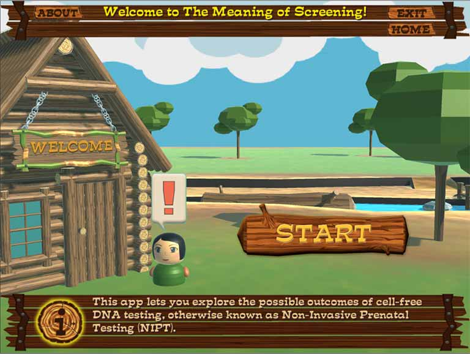
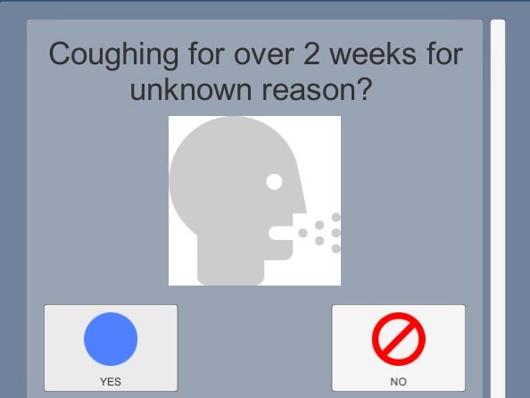

# Current Projects

Unannounced new mobile app...

# Past Projects

While this is not a comprehensive list (several projects remain under NDA),
these examples from [The GApp Lab](https://thegapp.eae.utah.edu/) showcase
some of my recent work in frontend design and engineering.  References and
samples may be available for other projects [upon request](#contact).

- ## [ The Meaning of Screening](./image/appscreen/MeaningScreening-screen03.jpg)
  A collaboration between our 3-person prototyping team and a medical
  research grant team, we designed this app to present facts and statistics
  about non-invasive prenatal screening to expectant parents in an
  approachable way, aiming to reduce decision anxiety and misinformation.
- ## [ DataMural ASHA Endpoint](https://datamural.com/)
  We worked with epidemiology data specialists DataMural LLC to design an
  app for [ASHAs](http://nhm.gov.in/communitisation/asha/about-asha.html)
  in Mumbai to screen for infectious diseases, integrating with portable
  testing devices and remote databases while allowing data collection
  without a persistent connection in the field.