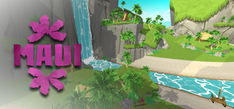

# Published Titles

These titles were team projects involving more than a dozen members each.
Information about team members or specific contributions can be found on my
[résumé](cv.html) or by request.

- ## [ Maui](http://www.kokuagames.com)
  ### (1 player, [Steam](http://store.steampowered.com/app/464700), Windows)
  A game honoring Hawaiian legend and history, with unique mechanics
  reflecting prayer to the Hawaiian pantheon.
- ## [ Heroes of Hat](https://www.youtube.com/watch?v=mdrF-lGexFI)
  ### (1--4 player, XBLIG, no longer available)
  A goblin faces down peril and humans led by a wicked dragon, with the
  help of friends and magical hats.

# Experiments
These web-based prototypes were each made in a single day.  
Mouse controls only!

[3&frac14;%](./3.25percent/)
: exploration of modern pointilism
  and the feeling of "stepping back" to expand consciousness

[High Roller](./highroller/)
: subversion of the "roll and move" turn-based board game concept;
  each roll determines the impulse strength of the next.
